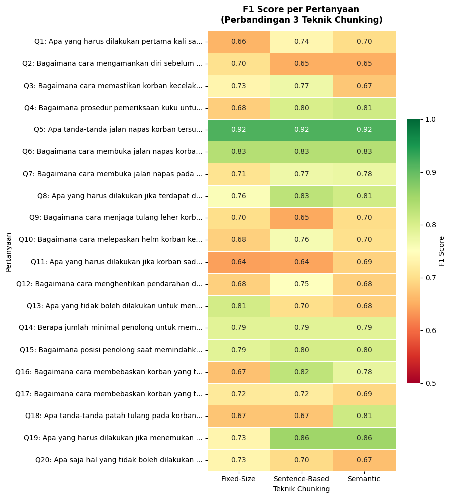

<div align="center">

  <h1>🚑 Analisis Strategi Chunking pada RAG</h1>
  <h3>untuk Buku Panduan Pertolongan Pertama</h3>
  <p><i>Membandingkan Fixed-Size, Sentence-Based, dan Semantic Chunking dalam sistem Retrieval-Augmented Generation berbasis IndoBERT</i></p>

  <br/>

  
  
  
  
  
  

  <br/><br/>

  <a href="#-latar-belakang-masalah">🔍 Masalah</a> &nbsp;•&nbsp;
  <a href="#-teknik-chunking">✂️ Chunking</a> &nbsp;•&nbsp;
  <a href="#️-arsitektur-sistem">🏗️ Arsitektur</a> &nbsp;•&nbsp;
  <a href="#-hasil-evaluasi">📊 Hasil</a> &nbsp;•&nbsp;
  <a href="#-cara-menjalankan">🚀 Jalankan</a>

</div>

---

## 🔍 Latar Belakang Masalah

Bayangkan seseorang sedang panik menghadapi korban kecelakaan, luka parah, atau kondisi darurat lainnya. Mereka butuh informasi yang **cepat, tepat, dan bisa diandalkan** dari buku panduan pertolongan pertama — tapi mencari halaman demi halaman tentu tidak efisien.

Di sinilah **RAG (Retrieval-Augmented Generation)** hadir: menggabungkan kemampuan pencarian dokumen dengan generasi teks (LLM), sehingga sistem bisa menjawab pertanyaan berbasis dokumen secara alami.

Namun, ada satu pertanyaan krusial yang sering diabaikan:

> **"Bagaimana cara terbaik memotong dokumen sebelum dimasukkan ke dalam sistem RAG?"**

Proses pemotongan dokumen ini disebut **Chunking** — dan pilihan strategi chunking ternyata **sangat berpengaruh** terhadap kualitas jawaban yang dihasilkan sistem.

### ❗ Masalah Utama

| Masalah | Penjelasan |
|---|---|
| **Konteks terputus** | Jika ukuran chunk terlalu kecil, informasi penting terpotong di tengah kalimat |
| **Noise berlebih** | Jika terlalu besar, chunk mengandung informasi tidak relevan yang membingungkan model |
| **Bahasa Indonesia** | Sumber daya NLP untuk Bahasa Indonesia masih terbatas, menambah kompleksitas |
| **Domain kritis** | Kesalahan informasi pertolongan pertama dapat membahayakan jiwa |

---

## ✂️ Teknik Chunking

Penelitian ini membandingkan tiga strategi chunking yang populer:

### 1. 📏 Fixed-Size Chunking

Membagi dokumen berdasarkan **jumlah karakter/token yang tetap**, tanpa mempertimbangkan struktur kalimat.

```
[DOKUMEN ASLI]
"Pertolongan pertama pada korban luka bakar ringan dimulai dengan..."

         ↓ potong setiap N token

[CHUNK 1]  "Pertolongan pertama pada korban luka"
[CHUNK 2]  "bakar ringan dimulai dengan menyiram"
[CHUNK 3]  "air bersih selama 10-20 menit..."
```

- ✅ Sederhana dan cepat diimplementasikan
- ❌ Memotong di tengah kalimat, merusak konteks semantik

---

### 2. 📝 Sentence-Based Chunking

Membagi dokumen berdasarkan **batas kalimat alami** (menggunakan tanda baca dan NLP sentence segmentation).

```
[DOKUMEN ASLI]
"Pertolongan pertama luka bakar ringan: siram dengan air. Jangan gunakan es."

         ↓ potong per kalimat / kelompok kalimat

[CHUNK 1]  "Pertolongan pertama luka bakar ringan: siram dengan air."
[CHUNK 2]  "Jangan gunakan es."
```

- ✅ Mempertahankan struktur kalimat yang utuh
- ✅ Konteks lebih dapat dipahami model
- ❌ Ukuran chunk bervariasi dan tidak selalu optimal

---

### 3. 🧠 Semantic Chunking

Membagi dokumen berdasarkan **kemiripan makna** antar kalimat menggunakan embedding model. Kalimat-kalimat dengan makna serupa dikelompokkan bersama.

```
[DOKUMEN ASLI]
"Periksa napas korban. Lakukan penekanan dada. Hubungi ambulans."
"Pastikan lokasi aman sebelum menolong korban."

         ↓ embedding → clustering semantik

[CHUNK 1]  "Periksa napas korban. Lakukan penekanan dada. Hubungi ambulans."
           (topik: resusitasi)

[CHUNK 2]  "Pastikan lokasi aman sebelum menolong korban."
           (topik: keamanan)
```

- ✅ Chunk paling koheren secara makna
- ✅ Relevansi retrieval lebih tinggi
- ❌ Komputasi lebih berat, membutuhkan embedding model

---

## 🏗️ Arsitektur Sistem

```
┌─────────────────────────────────────────────────────────────────┐
│                     PIPELINE RAG SISTEM                         │
│                                                                 │
│  ┌──────────────┐    ┌──────────────┐    ┌───────────────────┐  │
│  │              │    │              │    │                   │  │
│  │  Buku Panduan│───▶│   Chunking   │───▶│ Vector Embedding  │  │
│  │  Pertolongan │    │  (3 Teknik)  │    │  (IndoBERT/       │  │
│  │  Pertama     │    │              │    │   multilingual)   │  │
│  │  (PDF)       │    │              │    │                   │  │
│  └──────────────┘    └──────────────┘    └────────┬──────────┘  │
│                                                   │             │
│                                          ┌────────▼──────────┐  │
│                                          │                   │  │
│                                          │   Vector Store    │  │
│                                          │   (FAISS/Chroma)  │  │
│                                          │                   │  │
│                                          └────────┬──────────┘  │
│                                                   │             │
│  ┌──────────────┐    ┌──────────────┐    ┌────────▼──────────┐  │
│  │              │    │              │    │                   │  │
│  │   Jawaban    │◀───│ LLM/Generator│◀───│    Retriever      │  │
│  │   (Output)   │    │              │    │   (Top-K Chunks)  │  │
│  │              │    │              │    │                   │  │
│  └──────────────┘    └──────────────┘    └───────────────────┘  │
│                              ▲                                  │
│                              │                                  │
│                    ┌─────────┴──────────┐                       │
│                    │  Pertanyaan User   │                       │
│                    │  (Q & A Dataset)  │                       │
│                    └────────────────────┘                       │
└─────────────────────────────────────────────────────────────────┘
```

### 🔬 Pipeline Evaluasi & Ground Truth

Evaluasi pada penelitian ini tidak hanya melihat hasil ekstraksi secara mentah, tetapi menggunakan metode perbandingan dengan **Ground Truth** (jawaban ideal/referensi).

```text
Pertanyaan (Q) → Retrieve Chunk → Generate Jawaban
                                         │
                                         ▼
[Jawaban RAG] ────────(IndoBERT)──────▶ [Ground Truth]
                                         │
                                ┌────────▼─────────┐
                                │ Uji Kesamaan     │
                                │ Vektor           │
                                │ (BERTScore)      │
                                └──────────────────┘
```

Tahapan evaluasi kesamaan vektor:
1. **Dataset Ground Truth**: Disiapkan sekumpulan pertanyaan dan jawaban ideal (Ground Truth) yang secara manual divalidasi kebenarannya langsung dari buku panduan pertolongan pertama.
2. **Ekstraksi Sistem RAG**: Sistem mencari chunk yang relevan berdasarkan pertanyaan, kemudian men-*generate* jawaban secara otomatis.
3. **Uji Akurasi Vektor (IndoBERT)**: Jawaban hasil RAG kemudian diukur tingkat kesamaan semantik dan akurasinya terhadap **Ground Truth** menggunakan metrik *BERTScore*. Proses ini mengandalkan model **IndoBERT** (`bert-base-multilingual-cased`) sebagai penilai untuk memastikan substansi pertolongan pertamanya tetap selaras, akurat, dan tidak mengalami halusinasi.

**Model & Referensi Utama:**
- 🤗 `bert-base-multilingual-cased` (Multilingual/IndoBERT) — untuk evaluasi kesamaan vektor (BERTScore) dan embedding dasar.
- 📦 Sentence Transformers — untuk memproses *semantic chunking*.
- 📄 Sumber: *Buku Panduan Pertolongan Pertama* (dokumen PDF)

---

## 📊 Hasil Evaluasi

### Perbandingan BERTScore (Keseluruhan)

| Teknik Chunking | Precision | Recall | F1 Score |
|:---|:---:|:---:|:---:|
| Fixed-Size | 0.7339 | 0.7293 | 0.7302 |
| Sentence-Based | **0.7552** | **0.7652** | **0.7587** ✅ |
| Semantic | 0.7517 | 0.7522 | 0.7509 |

> 🏆 **Pemenang: Sentence-Based Chunking** dengan F1 Score tertinggi = **0.7587**

---

### 📉 Bar Chart — Perbandingan Keseluruhan


*Grafik di atas menunjukkan perbandingan Precision, Recall, dan F1 Score untuk ketiga teknik chunking. Sentence-Based secara konsisten unggul di semua metrik.*

---

### 🌡️ Heatmap — F1 Score per Pertanyaan



*Heatmap ini menampilkan performa tiap teknik chunking untuk masing-masing pertanyaan (Q1–Q20) dari dataset evaluasi. Warna hijau = skor tinggi, merah = skor rendah.*

---

### 💡 Interpretasi Hasil

```
Sentence-Based > Semantic > Fixed-Size

Mengapa Sentence-Based menang?
├── ✅ Kalimat di buku panduan umumnya bersifat prosedural
├── ✅ Satu kalimat = satu instruksi = informasi yang utuh
├── ✅ Lebih mudah di-retrieve karena unit informasi jelas
└── ✅ Tidak memerlukan komputasi tambahan seperti Semantic
```

---

## 🚀 Cara Menjalankan

### Prasyarat

- Python 3.8+
- Google Colab (dengan GPU T4 aktif)
- Akun Hugging Face (untuk download model)

### Langkah-langkah

```bash
# 1. Clone repository
git clone https://github.com/[username]/kti-chunking-rag.git

# 2. Buka notebook di Google Colab
# Upload: Panduan_kti (3).ipynb

# 3. Install dependensi (otomatis di sel pertama notebook)
pip install transformers sentence-transformers faiss-cpu bert-score

# 4. Jalankan sel secara berurutan
```

### Struktur Notebook

```
Panduan_kti (3).ipynb
├── Bagian 1: Setup & Import
├── Bagian 2: Load Dokumen PDF
├── Bagian 3: Preprocessing
├── Bagian 4: Fixed-Size Chunking
├── Bagian 5: Sentence-Based Chunking
├── Bagian 6: Semantic Chunking
├── Bagian 7: Embedding & Vector Store
├── Bagian 8: RAG Pipeline
├── Bagian 9: Evaluasi BERTScore
└── Bagian 10: Visualisasi Hasil
```

---

## 📁 Struktur Direktori

```
📂 Karya Tulis Ilmiah/
├── 📓 Panduan_kti (3).ipynb   ← Notebook utama
├── 📄 pertolongan.pdf          ← Buku panduan pertolongan pertama
├── 📂 asset/
│   ├── 🖼️ image copy.png       ← Bar chart BERTScore
│   └── 🖼️ image.png            ← Heatmap F1 per pertanyaan
└── 📂 Dafpus/                  ← Referensi & daftar pustaka
    ├── BERTScore_Zhang.pdf
    ├── ChunkingImpact_maximilian.pdf
    ├── RAG_Lewis.pdf
    └── ... (dan referensi lainnya)
```

---

## 📚 Referensi Utama

| Referensi | Topik |
|---|---|
| Zhang et al. (BERTScore) | Metrik evaluasi berbasis BERT |
| Lewis et al. (RAG) | Retrieval-Augmented Generation |
| Carlo et al. (Chunk Strategy) | Strategi chunking untuk RAG |
| He et al. (Dynamic Chunking) | Chunking dinamis |
| Zakka et al. (RAG Clinical) | RAG di domain medis/klinis |

---

## 👤 Penulis

**Emirsyah Rafsanjani**
> Karya Tulis Ilmiah — Semester 6

---

<div align="center">

*Penelitian ini bertujuan membantu pengembangan sistem informasi darurat berbasis AI yang lebih akurat dan dapat diandalkan untuk konteks Bahasa Indonesia.*

</div>
